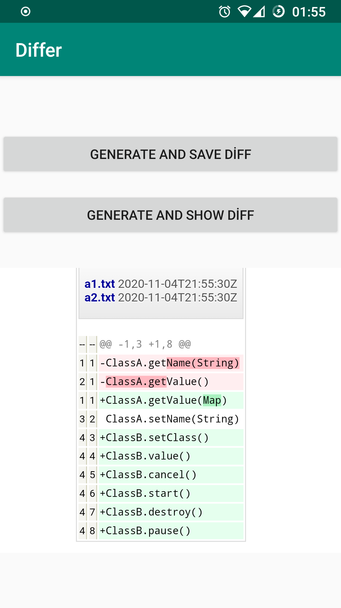

# Differ

Differ is an Android library for file/directory diff generation and visualization as HTML(and as webview)
It is based on https://github.com/cronn-de/diff-to-html and adapted/ported to Android by me

## GETTING STARTED

W.I.P

### Current Features

- It supports File based and/or Directory based diffing
- Visualization with 'DiffView' that you can use it on your screens
W.I.P

### Screenshots

### Examples

Example codes are on the sample app source codes (Check 'app' directory)

W:I.P

### Contributing

Any contributions are welcome :+1:
